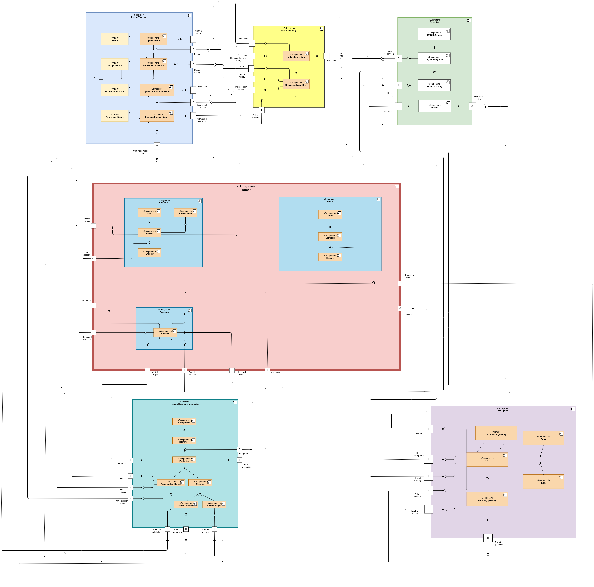

======================
Architecture Diagram
======================

This page provides an overview of the software architecture, detailing each major component and its purpose within the TIAGo-based meal preparation system.

Let's now take a brief look at each component to better understand their application, and analyze which design patterns could be adopted to achieve the best implementation for each of them.

The global architecture of the system is described by the following :ref:`component diagram <uml-c>`. 
The robot is equipped with various sensors and services, such as an RGB-D Camera, LiDAR, SONAR, force sensors, microphones, and speakers. The architecture is designed so that these components work together seamlessly to support the meal preparation process.

The process begins with the **Recipe Tracking and Execution History Subsystem** and the **Human Command Monitoring and Conflict Resolution Subsystem**. The Recipe Tracking Subsystem maintains an internal representation of the recipe and the sequence of actions performed, ensuring that each step is followed correctly. The Human Command Monitoring Subsystem captures verbal commands from the user through microphones and evaluates their alignment with the meal preparation plan. It resolves any conflicts, ensuring the robot can adapt to user input while maintaining task integrity.

Both of these subsystems feed information to the **Action Planning Subsystem**, which determines the next steps based on the current state of meal preparation and the history of actions taken. This planning is dynamic, adjusting to unexpected conditions or verbal commands from the user.

Once the Action Planning Subsystem decides on the next action, it relies on the **Perception Subsystem** to execute it. The Perception Subsystem uses the RGB-D Camera to capture depth and RGB images, allowing it to map the environment in real-time and recognize objects. This data is crucial for the **Navigation Subsystem**, which plans efficient and obstacle-free paths using LiDAR for precise navigation and SONAR for measuring distances.

Finally, the **Robot Subsystem** comes into play, using force sensors and arm joints to handle tools and ingredients with precision. This subsystem executes the commands decided by the Action Planning Subsystem, ensuring that the robot can navigate the environment, recognize and manipulate objects, and interact with the user to ensure a smooth and safe meal preparation process.

Throughout this process, the subsystems work together, sharing data and coordinating actions to provide a cohesive and adaptive system for meal preparation assistance.

-------------------------------------------------------------
Design Patterns in Meal Preparation Assistance Architecture
-------------------------------------------------------------

Design patterns provide proven solutions to common software design challenges, enhancing the flexibility and maintainability of systems. In the context of a TIAGo robot assisting with meal preparation, several design patterns can be effectively applied:

- **Singleton Pattern**: Implement the **Recipe Tracking and Execution History Subsystem** as a Singleton to ensure a single, consistent instance that all components can access. This prevents conflicts and maintains data integrity.

- **Adapter Pattern**: Use adapters in the **Perception Subsystem** to convert data from various sensors (e.g., RGB-D Camera, LiDAR) into a unified format. This allows seamless integration with the **Navigation** and **Robot Subsystems**, enhancing flexibility.

- **Command Pattern**: Encapsulate user commands in the **Human Command Monitoring and Conflict Resolution Subsystem** as command objects. This allows for flexible handling, queuing, and logging of commands, decoupling user input from action execution.

- **Mediator Pattern**: Implement a mediator to centralize communication between subsystems like **Recipe Tracking**, **Action Planning**, and **Robot Subsystems**. This reduces complexity and ensures coordinated interactions.

- **Observer Pattern**: Use the Observer Pattern in the **Recipe Tracking Subsystem** to notify other subsystems of changes in recipe state, ensuring real-time synchronization across components.

- **Strategy Pattern**: Apply the Strategy Pattern in the **Action Planning Subsystem** to dynamically select different planning algorithms based on the current state or user preferences, enhancing adaptability.

-----------------
Recipe tracking
-----------------

The **recipe tracking and execution history** component is a subsystem that incorporates other components and artifacts which together are responsible for tracking the recipe to be cooked and its progress status through connections with the :doc:`action planning <action_planning>` e :doc:`human command <human_command>`. Within this subsystem, all components are connected to their corresponding artifacts, which represent tangible resources within the system. Each artifact is updated based on the activation of its component, and some artifacts are also used to trigger other internal components. 

As we can observe, there are two ports that are not connected to any internal component, as these serve as the input and output for the :doc:`error handler <error_handler>` component, which will manage any recovery procedures.

.. rubric:: Implementation through patterns

The **recipe** component must be implemented using the **singleton** pattern, since the robot can cook only one recipe at a time. Therefore, multiple instances of a recipe cannot exist simultaneously, as that would imply the robot could cook multiple recipes at the same time.

-----------------
Action planning
-----------------

Every 100 ms the planner starts a new cycle by reading data from various channels and checking for unexpected conditions. If the recipe has failed, it signals an error and reboots the system; otherwise, it updates the best next action. If the recipe is finished, it notifies completion; if not, it updates ongoing actions, commands the robots, and ends the cycle.

As we can observe, there are two ports that are not connected to any internal component, as these serve as the input and output for the :doc:`error handler <error_handler>` component, which will manage any recovery procedures.

.. rubric:: Implementation through patterns

The **update best action** component can be implemented using the **strategy** design pattern. This pattern is a behavioral design pattern that allows selecting an algorithm at runtime. Rather than implementing a single fixed algorithm, the system can choose from a family of predefined strategies based on the context. In our case, depending on the input received by the component, it determines and applies the most appropriate action to execute.

-----------------
Human command
-----------------

The planner continuously listens for human commands through the "Microphones" component, generating an "Audio Track" variable and evaluating whether an interaction has occurred. If there is no interaction, the cycle stops; if there is, it processes the message through the "Interpreter" component. If the message is not a valid sentence, the system asks the user to repeat it. Once a valid sentence is interpreted, the system checks if it's the first interaction and whether ingredients have been shown. Depending on the input, it either requests a recipe or ingredient list and attempts to connect to Wi-Fi. If Wi-Fi connection fails, it signals an error; if successful, it searches for a recipe or proposes a some recipes based on available ingredients.

During recipe execution, the system can accept verbal commands. It validates these commands and, if valid, updates the recipe history and provides appropriate responses. The robot's state is updated by the "High Level Action" component, ensuring that each step is executed according to the latest recipe information.

As we can observe, there are two ports that are not connected to any internal component, as these serve as the input and output for the :doc:`error handler <error_handler>` component, which will manage any recovery procedures.

.. rubric:: Implementation through patterns

First, the **Wi-Fi connection** manager component should be implemented as a **singleton** pattern, as there must be only one object responsible for handling internet requests, such as searching for recipes or proposals. This design choice is justified by the fact that there is only one physical Wi-Fi device available, and creating multiple instances could lead to consistency issues.

Next, to connect the **microphone** to the **interpreter**, we need an interface that handles the microphone's output data and adapts it so that the interpreter component can correctly process it in the input format it expects. To achieve this, we need to apply the **adapter** pattern.

As we mentioned in the previous component, the **strategy** pattern is a behavioral design pattern that enables the selection of an algorithm at runtime. In our case, the entire flow starting from the **evaluate** component can be represented using the Strategy pattern, since the behavior changes dynamically based on the user's request. For example:

-  If the user asks for a new recipe, the system needs to search online.
-  If the user requests new suggestions based on the ingredients they have at home, the system must search accordingly.
-  If the user issues a voice command, the robot needs to execute it.

Each of these actions represents a different strategy that can be selected and executed at runtime.

-----------------
Perception
-----------------

The **perception** component includes a module for the **camera**, which collects visual information from the robot. Through the **object recognition** and **object tracking** components, it analyzes the images to recognize and track objects, exposing these functionalities to various components that require them, such as the :doc:`navigation<navigation>`.

As we can observe, there are two ports that are not connected to any internal component, as these serve as the input and output for the :doc:`error handler <error_handler>` component, which will manage any recovery procedures.

.. rubric:: Implementation through patterns

Similarly, the **camera** component will be implemented using the **singleton** pattern, since, as previously explained, multiple instances of the same component cannot exist: the physical device is unique, and having multiple instances would lead to consistency issues.

Additionally, in order to communicate with the component responsible for **object recognition**, the **camera** component must use the **adapter** pattern to ensure data consistency during exchanges.

The **planner high level** component is responsible for translating the actions received from the :doc:`action planning<action_planning>` module into actual commands for the robot. It manages the :doc:`navigation<navigation>` component, which, based on the known map and the task to be performed, determines the optimal path for the :doc:`motion<motion>` module to follow or the specific actions to be executed by the :doc:`Gripper<gripper>`.

Additionally, there is an artifact that keeps track of the **robot's current state** for example, states like cutting, cooking, grabbing, and so on. The robot's state dynamically updates according to the current situation.

Finally, there is a component that monitors the robot’s **battery level**. This component is responsible for managing the charge status and the :doc:`error handler <error_handler>` will send a vocal warning signal when the battery is running low.

As we can observe, there are two ports that are not connected to any internal component, as these serve as the input and output for the :doc:`error handler <error_handler>` component, which will manage any recovery procedures.

.. rubric:: Implementation through patterns

The **state** pattern is a behavioral design pattern that allows an object to change its behavior based on its internal state. It appears as if the object has changed its class. 

To effectively implement the **robot state** component, we can apply the **state** pattern. This is because the robot can be in various states, such as `noRecipe`, `cooking`, `cutting`, or `error`, each encapsulating its own transition logic. This approach helps avoid long chains of `if/else` statements. Moreover, since the robot’s behavior must change dynamically at runtime based on its current state, this pattern is particularly well suited for this purpose.

Since this component plays a key role by centralizing the management of hardware components responsible for movement, navigation, and the gripper, and because it dynamically alters the program's behavior at runtime, it could also be implemented using the **mediator** design pattern instead of the **state** pattern. The Mediator pattern is particularly suitable in cases like this, where a single component centralizes and manages complex interactions between multiple parts of the system.

-----------------
Navigation
-----------------

The **navigation** component is used to create and manage the environment map through the connected sensors, saving it via the artifact linked to the **SLAM** component.

The **trajectory planning** component is responsible for generating the path that the robot must follow based on the actions received from the :doc:`planner<planner>` module. To do this, it requires data from other modules, such as :doc:`perception<perception>` for obstacle detection and tracking, :doc:`motion<motion>` for wheel encoder data, and :doc:`gripper<gripper>` for gripper encoder feedback. If the planner's command involves moving the robot base, the trajectory planner will generate an optimal path and send velocity commands to the wheels. If, instead, the command involves moving the robotic arm, the component will generate a sequence of actions for the arm to reach the target goal.
| With the integration of **LIDAR** and **SONAR** sensors, the component can build and continuously update a 360-degree map of the environment.

As we can observe, there are two ports that are not connected to any internal component, as these serve as the input and output for the :doc:`error handler <error_handler>` component, which will manage any recovery procedures.

.. rubric:: Implementation through patterns

To connect the **SLAM** component to the two internal sensors, LIDAR and SONAR, it is necessary to implement them using the **adapter** pattern, in order to make the exchanged data compatible and allow SLAM to manage them properly.

-----------------
Robot
-----------------

The **motion** component is used to manage, as the name suggests, the robot's navigation through the **encoders**, **controllers**, and **motors** of both wheels. The **controllers** components will receive the speed signal to be set for the wheels from the module **trajectory planning** within the :doc:`navigation<navigation>`.

As we can observe, there are two ports that are not connected to any internal component, as these serve as the input and output for the :doc:`error handler <error_handler>` component, which will manage any recovery procedures.

.. rubric:: Implementation through patterns

As previously mentioned for the :doc:`gripper<gripper>`, the **motor controllers** in the motion component will also be implemented using the **singleton** pattern, since multiple instances of the same controller are not allowed.

To connect the **encoders** to their respective **controllers**, the **adapter** pattern will be required to resolve the mismatch between the exchanged data.

The **speaker** component manages verbal communication between the robot and nearby people through speakers. It receives messages from the various connected components and vocally reproduces them using its internal module.

As we can observe, there are two ports that are not connected to any internal component, as these serve as the input and output for the :doc:`error handler <error_handler>` component, which will manage any recovery procedures.

.. rubric:: Implementation through patterns

The **speaker** component must be implemented using the **singleton** pattern since the robot has only one audio output device. Multiple instances of the speaker class would create conflicts in accessing the shared hardware resource, as different system components might attempt to use the single physical speaker simultaneously.

The **gripper** component manages the end part of the robotic arm. It includes the components necessary for movement, namely the **encoder**, **controller**, and **motor**, along with a **force sensor** connected to the controller.

This component uses the :doc:`perception<perception>` module to track the movement of the object and monitor its position within the gripper.
| Actions are issued to the controller through the **trajectory planning** component inside the :doc:`navigation<navigation>`.

As we can observe, there are two ports that are not connected to any internal component, as these serve as the input and output for the :doc:`error handler <error_handler>` component, which will manage any recovery procedures.

.. rubric:: Implementation through patterns

The **motor controller** is implemented using the **singleton** pattern, as there must be at most one instance per controller; otherwise, consistency issues could arise, since there is only one physical controller.

Furthermore, to connect the **encoder** to the **controller**, the **adapter** pattern must be used to handle the mismatch between their different data types. Similarly, the **force sensor**, which the controller uses to regulate the gripper's force, is also integrated using the **adapter** pattern, as it exchanges a different type of data compared to the controller. The use of the adapter allows the controller to properly handle the incoming data.

.. toctree::
    :maxdepth: 2

