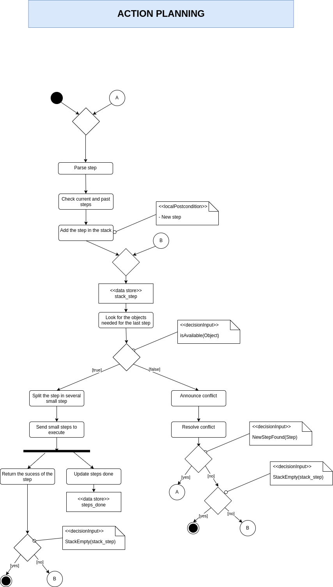
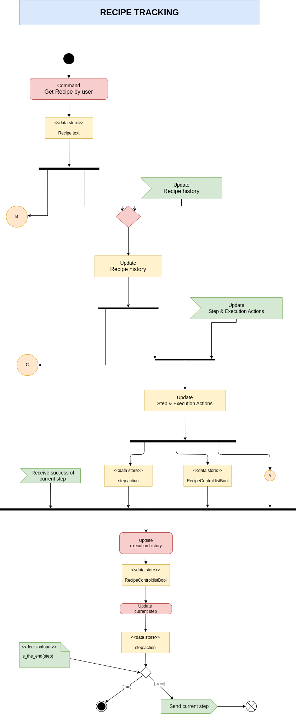
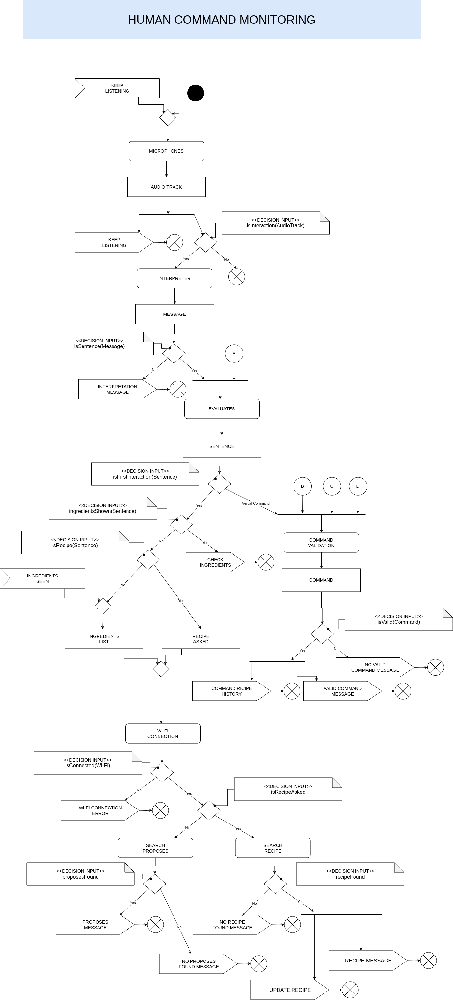

Behavioural diagram
====================

   

Objects
-------

This components use 4 different objects:

Recipe
^^^^^^

Recipe : List of actions to be executed (variable number). Each action includes:

- a label with the name of the action (used by the "High Level" component),
- an integer indicating the order of the actions (used by the objects "Recipe History" and "On Execution Actions"),
- a boolean indicating whether the action is mandatory (used by the "Command Validation" component),
- an array of integers (variable number) representing prerequisite actions that must be completed beforehand (used by the "Command Validation" and "Unexpected Condition Check" components),
- an array of integers (variable number) representing the tools to be used (used by the "High Level" component),
- an array of integers (variable number) representing the ingredients required (used by the "High Level" component).

The robot already has an internal representation of all the tools and ingredients with an associated value to be recognized and knows how to handle them according to the action to be performed;

Recipe History
^^^^^^^^^^^^^^

Recipe History : List of executed actions. It inherits everything from the "Recipe" object, and adds:

- a boolean indicating whether the action has been executed (used by the "Command Validation" and "Unexpected Condition Check" components) and
- an integer that indicates the order of execution (used by the "Update On Execution Actions" component);

New Recipe History
^^^^^^^^^^^^^^^^^^

New Recipe History : List of executed actions with new ones requested by the human. It inherits everything from the "Recipe History" object and adds a boolean that highlights the new actions (used by the "Update Best Action" component);

On Execution Actions
^^^^^^^^^^^^^^^^^^^^

On Execution Actions : List of actions currently being executed. It inherits everything from the "Recipe" object, and adds:

- a boolean to highlights if the action is in execution (used by the "Command Validation" and "Unexpected Condition Check" components),
- an integer that indicates the time of execution remained (used by the "Command Validation" and "Unexpected Condition Check" components) and
- a boolean indicating whether the action is interruptable (used by the "Command Validation" component).

At robot startup, all the objects are initialized NULL.

Communication Channels
----------------------

All the connectors are always-on data channels:

- A is the Robot State (initialized as "No Recipe");
- B is the Recipe;
- C is the Recipe History;
- D is the On Execution Actions;
- E is the New Recipe History;
- F is the Object Tracking.

System Initialization
---------------------

The robot can be started asking directly for a specific recipe, telling him ingredients by voice to ask for proposes or just showing him the ingredients to ask for proposes.

Human Command Monitoring and Conflict Resolution
------------------------------------------------

The planner starts immediately to listen to human commands using the component "Microphones".
This create an "Audio Track" variable and it then evaluates if isInteraction?

- NO → stop the cycle.
- YES → continue.

Also, a "Keep Listening" signal is generated to restart the listening cycle.
On the "yes" branch, the "Interpreter" component generates the "Message" variable and evaluates if isSentence?

- NO → emit an "Interpretation Message" to the "Speaker" component (the message "Please, repete" is reproduced) and stop the cycle.
- YES → continue.

On the "yes" branch, the message is merged with the channel A (Robot State data) and sent to the "Evaluates" component.
It generates a "Sentence" variable and evaluates if isFirstInteraction?

- YES (the condition is yes if the "Robot State" is "No Recipe") → it evaluates if ingredientsShown?
  
  - YES → emits a "Check Ingredients" signal to the "Perception" component (in order to recognize the ingrediets shown) and stop the cycle.
  - NO → it evaluates if isRecipe?
    
    - YES → produce a "Recipe Asked" variable with the name of the recipe.
    - NO → when ingredients are spoken OR shown (form "Object Tracking" component the "Ingredients Seen" signal is send), an "Ingredients List" variable is generated.
    
    Whether it's an "Ingredients List" OR a "Recipe Asked", the robot try to connect by "Wi-Fi Connection".
    It evaluates if isConnected?
    
    - NO → emit a "Wi-Fi Connection Error" to the "Error Handler" component (send to the speaker the message "Please connect to Wi-Fi" and reboot the Wi-Fi component) and stop the cycle. 
    - YES → it evaluates if isRecipeAsked? (check the variable that started the Wi-Fi connenction)
      
      - NO → the component "Search Proposes" is started and than evaluates if proposesFound?
        
        - YES → emit a "Proposes Message" signal to the "Speaker" component (recipe proposes are reproduced) and stop the cycle.
        - NO → emit a "No Proposes Found Messagge" signal to the "Speaker" component (the message "No proposes found with this ingredients" is reproduced) and stop the cycle.
      
      - YES → the component "Search Recipe" is started and than evaluates if recipeFound?
        
        - NO → emit a "No Recipe Found Messagge" signal to the "Speaker" component (the message "Recipe not found" is reproduced) and stop the cycle.
        - YES → emit a "Recipe Messagge" signal to the "Speaker" component (the message "OK, let's start the recipe" is reproduced) and an "Update Recipe" signal to the namesake component, then stop the cycle.

VERBAL COMMAND → during the execution of the recipe, verbal command can be given by the human. With the information provided by the channels B (Recipe data), C (Recipe History data) and D (On Execution Actions data), the "Command Validation" component generates a "Command" variable. It evaluates if isValid?

- NO → emit a "No Valid Command Messagge" signal to the "Speaker" component (the message "Sorry, I can't" is reproduced) and stop the cycle.
- YES → emit a "Valid Command Message" signal to the "Speaker" component (the message "OK" is reproduced) and a "Command Recipe History" signal to the namesake component, then stop the cycle.

The Robot State is updated by the "High Level Action" component, so when "Recipe" is updated and the first action of the recipe starts, the Robot State will not be anymore in "No Recipe" State.

Recipe Tracking and Execution History
-------------------------------------

The planner starts when an "Update Recipe" signal comes from the "Search Recipe" component.
The "Update Recipe" component takes from internet the steps of the recipe and update the "Recipe" object. This step is done just one time to initialize the recipe.
The object is continuously fed to channel B and also used by the next component "Update Recipe History".
When the "Update Recipe" finishes OR when an "Update Recipe History" signal arrives, the "Update Recipe History" component starts and update the object "Recipe History".
This object is continuously fed to channel C and also used by the next component "Update On Execution Actions".
Here the planner waits an "Update On Execution Actions" signal from the "Update Best Action" component.
When received, the component "Update On Execution Actions" updates the "On Execution Actions" object, thanks to the information given by the "New Best Action" variable.
The object is continuously fed to channel D and also emits a new "Update Recipe History" signal, so that completed actions are logged in "Recipe History", then stop the cycle.

In parallel to this execution there is the "Command Recipe History" component, triggered by the namesake signal, that inherits the "Recipe History" object and update the "New Recipe History" object when the human asks a valid command.

Action Planning Based on Cooking State and Task History
-------------------------------------------------------

Every 100 ms tick the planner is triggered to begin a new cycle.
At the start of the cycle, it reads the latest values from the always-on channels C (Recipe History data), D (On Execution Actions data) and F (Object tracking data).
It immediately performs an "Unexpected Condition Check", that will check for unexpected condition caused by the human agent (seen with the object tracking), that can affect the recipe history or the action to execute.
It then evaluates if isRecipeFailed?

- Yes → emit a "Recipe Fail Error" signal to the "Error Handler" component (send to the speaker the message "Recipe Failed, please provide a new recipe", then will stop all the actions and reboot the system) and stop the cycle.
- No → continue.

On the "no" branch, it forks, with the information given by the Unexpected Condition Check, datas from channels A (Robot State data), B (Recipe) and E (New Recipe History), all in parallel, and feeds them into the next step.
It then executes "Update Best Action", computing the optimal next cooking step and outputs a "New Best Action" variable.
It evaluates if isRecipeFinished?

- Yes → emit a "Notify Action" signal to the "High Level Action" component (send to the speaker the message "Recipe Finished" and update the robot state) and stop the cycle.
- No → fork into two parallel tasks:
  
  - emit an "Update On Execution Actions" signal to the namesake component (log the new action), and
  - emit a "Notify Action" signal to the "High Level Action" component (send the command to the actuators and update the robot state).

When those two complete, the cycle ends.

The "High Level Action" component translates the action label in the "Recipe" object into an actual robotic tasks, using tools and ingredients specified in the same object.
